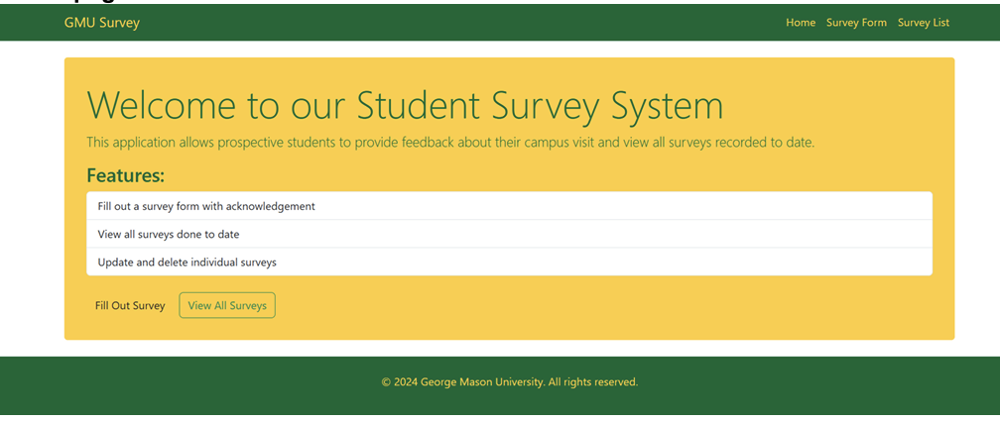
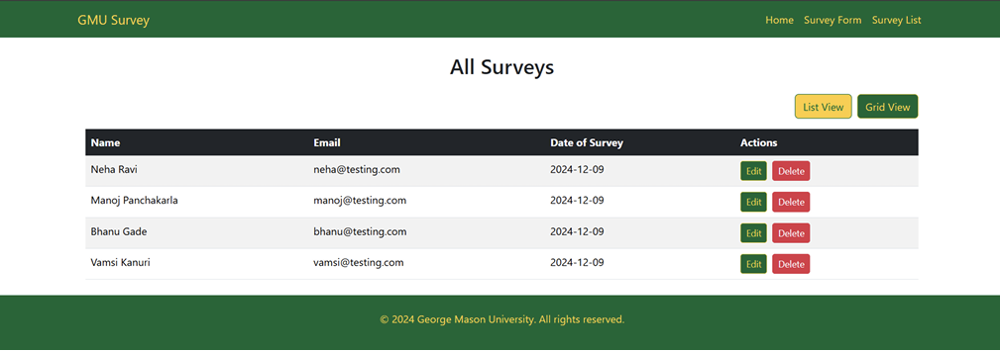

# 🧾 Campus Feedback Portal – Vue.js + Spring Boot

A modern full-stack web application built with **Vue.js** (frontend) and **Spring Boot** (backend) that enables prospective students to submit and manage feedback about their campus visit experience.

This project demonstrates the reimplementation of a student feedback system with a Vue.js frontend that integrates seamlessly with an existing Spring Boot + MySQL backend.

---

## 📌 Overview

The Campus Feedback Portal allows users to:
- Fill out a dynamic survey form capturing personal details, preferences, and additional comments
- View all submitted surveys
- Edit or delete individual survey records

It provides a responsive UI, modular Vue components, and REST API integration with the backend for complete CRUD functionality.

---

## 🛠️ Tech Stack

### 🌐 Frontend
- Vue.js 3 (Composition API)
- Vue Router
- Axios (for RESTful API integration)

### ⚙️ Backend
- Spring Boot (Java)
- JPA + Hibernate
- MySQL

### 🔧 Tools
- Maven
- Vue CLI
- REST APIs

---

## ✨ Features

- **Survey Form**: Collects name, address, email, contact info, feedback checkboxes, radio buttons, and comments
- **Data Management**: View, edit, and delete submitted feedback
- **REST Integration**: Frontend communicates with backend APIs using Axios
- **Responsive UI**: Clean layout and mobile-friendly design

---

### Home Page

### 🖼️ Survey List

